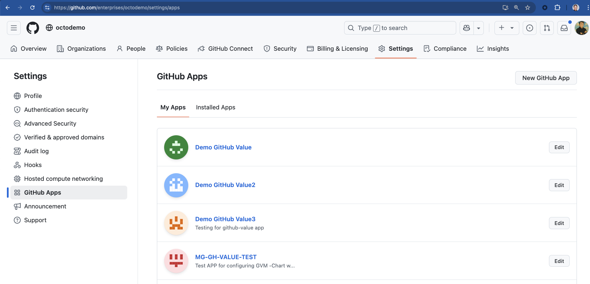
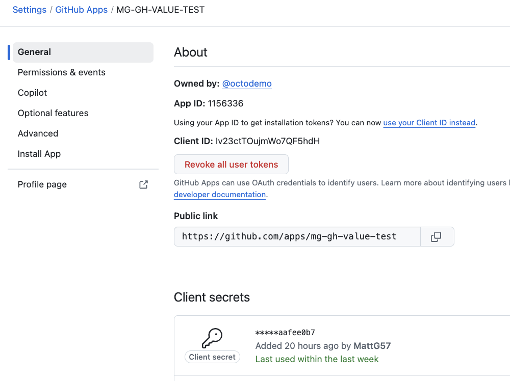
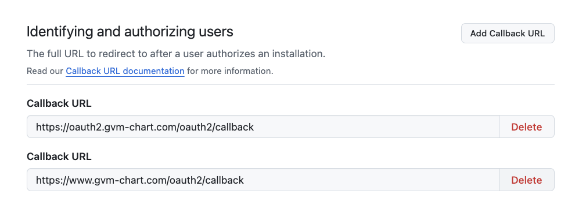
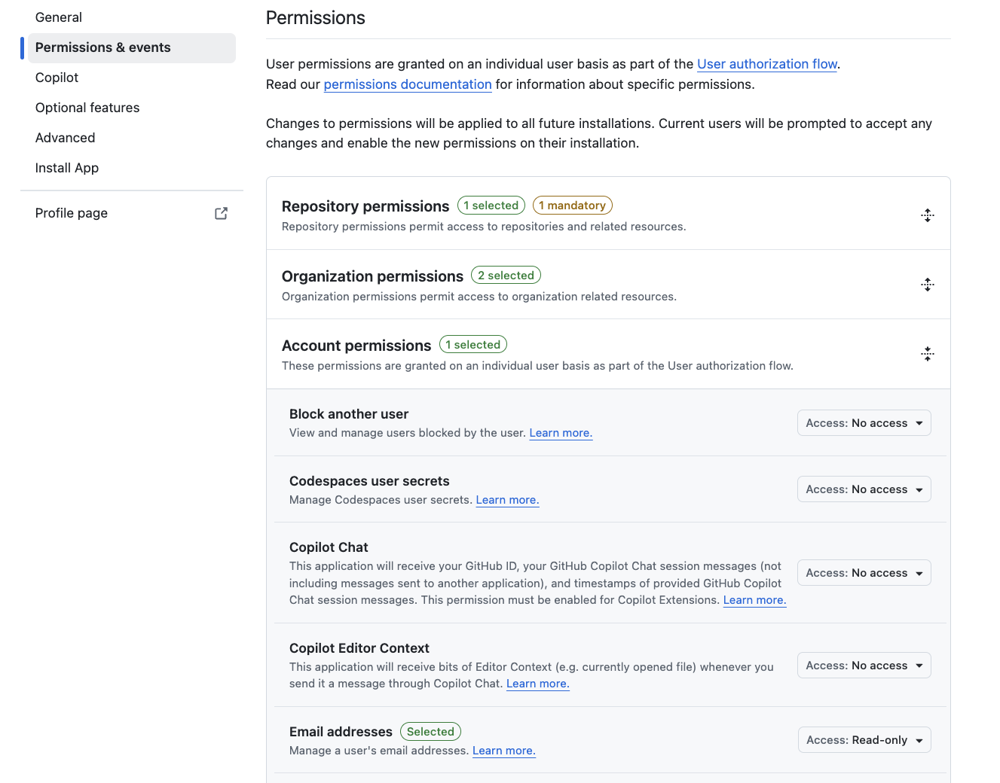

# Configurable Nginx Ingress Setup

This directory contains a templating system for setting up Nginx Ingress with flexible authentication options.

## Configuration

Edit the `ingress-config.sh` file to configure:

- Domain name for ingress resources
- Kubernetes namespace
- Application service and port
- Certificate issuer settings
- Basic authentication credentials 
- OAuth2 Provider settings

## Usage

1. Edit `ingress-config.sh` with your specific settings
2. Run the template rendering script:
   ```bash
   ./render-templates.sh
   ```
3. Navigate to the rendered directory and run the setup script:
   ```bash
   cd rendered
   ./setup-i.sh
   ```

To start from a specific step:
```bash
./setup-i.sh 5  # Start from step 5
```

## Components

- Nginx Ingress Controller
- Cert-Manager with Let's Encrypt integration
- Basic authentication
- OAuth2 authentication (GitHub, Google, etc.)
- Sample web application

## Authentication Options

Two authentication methods are set up:
1. **Basic Auth**: Username/password authentication (configured in `ingress-config.sh`)
2. **OAuth2**: OAuth authentication (requires valid OAuth app registration)

## Verification

After setup, you can run:
```bash
./verify-oauth-service.sh
```
to validate the OAuth2 service configuration.

## Troubleshooting

If you encounter issues, run:
```bash
./troubleshoot.sh
```
to collect diagnostic information.

## Customization

The template system allows you to easily customize all aspects of the deployment by:

1. Modifying the `ingress-config.sh` file with your specific values
2. Running `render-templates.sh` to generate a custom configuration
3. Deploying the customized configuration

This approach makes it easy to manage multiple environments with different settings.

# Appendix: Enable OAuth Support for GitHub App Authentication

## 1. Start from Your Existing App Settings Page
Begin in the **GitHub App settings page** for your own app (e.g., from your Node.js app config flow).

- ✅ Confirm that you're editing the correct GitHub App.
- The **App Name** in the screenshots (`MG-GH-VALUE-TEST`) is **just an example** — your app name may be different.
- Verify the **organization** (e.g., `octodemo`) matches your setup.


---

## 2. Locate the App in GitHub
If needed, navigate to: `https://github.com/enterprises/octodemo/settings/apps`  
Then go to the **Settings** tab → **GitHub Apps**  
Click on the app name **MG-GH-VALUE-TEST** to configure  


---

## 3. Open General Settings
Go to the **General** tab of your GitHub App.  
- Note the **App ID** and **Client ID**
- Create a new **Client Secret** if needed  
- Copy the **Public Link** for later testing  


---

## 4. Add Callback URLs
In the **General** tab, scroll to **Identifying and authorizing users**  
Add your required **Callback URLs**, such as:
- `https://oauth2.gvm-chart.com/oauth2/callback`
- `https://www.gvm-chart.com/oauth2/callback`  


---

## 5. Set Required Permissions
Go to **Permissions & events**  
Under **Account permissions**, enable:
- `Email addresses` → **Read-only**  

